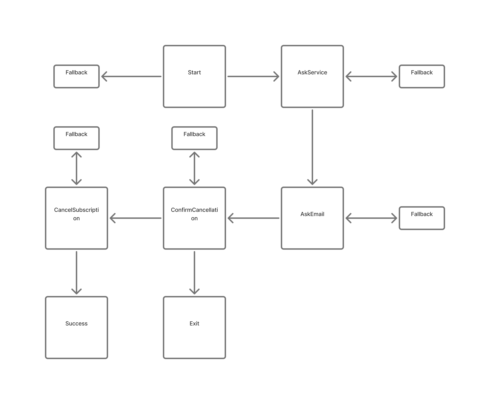

# Conversational & Multimodal AI Flows

Conversational AI design requires explicit intent handling, clear state management, and error recovery. These flows translate those principles into user-facing interactions.

This page documents a set of conversational interaction patterns exploring how users control intent, depth, and recovery in AI systems. Each flow demonstrates a different interaction model, with a shared focus on explicit triggers, fallback handling, and user trust.

---

## Flow 1: Cancel Subscription Assistant

**Overview**  
A transactional conversational flow designed to help users cancel a gym subscription. The flow emphasizes explicit confirmation, scope control, and error recovery when user intent is unclear.

**What this demonstrates**
- Intent detection and routing
- Confirmation before irreversible actions
- Clear exit paths and recovery handling
- UX flow structure maps 1:1 to code implementation

**Implementation**
- Python agent with rule-based intent extraction and conditional routing

---

## Flow 2: Multimodal Summarization Flow

**Overview**  
A multimodal interaction pattern where voice leads the experience and visual UI supports exploration without increasing cognitive load. Designed for XR or hands-free contexts.

**What this demonstrates**
- Voice-led interaction with visual persistence
- Progressive disclosure of information
- Explicit user-triggered state changes
- Repair and clarification when intent is ambiguous
- Clear distinction between system actions and user reactions

---

## Design Principles Across Flows

- User actions explicitly trigger system responses  
- UI state changes never occur without a visible cause  
- Voice output is brief; visual UI carries structure and depth  
- Fallback and clarification paths are treated as first-class design elements  

---
